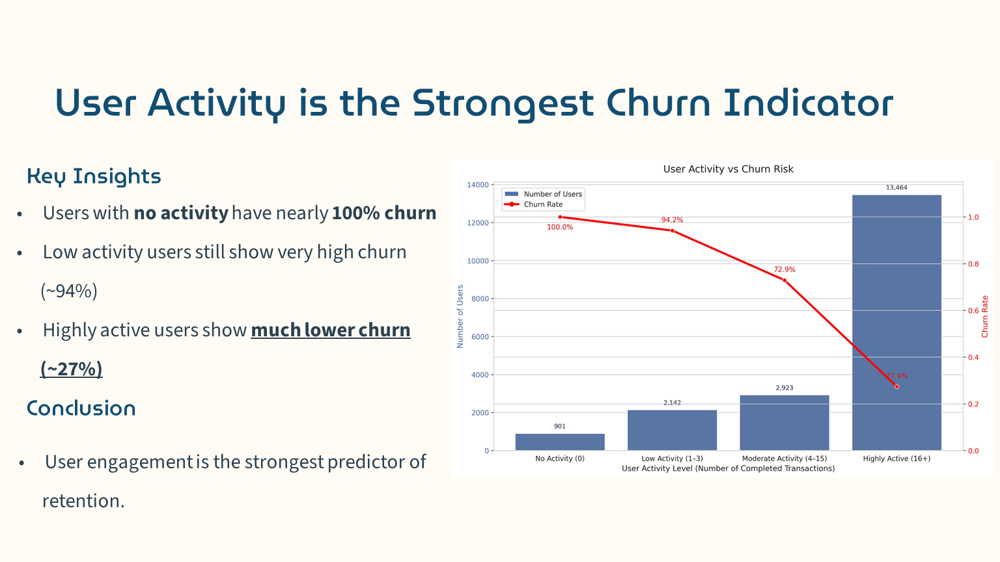
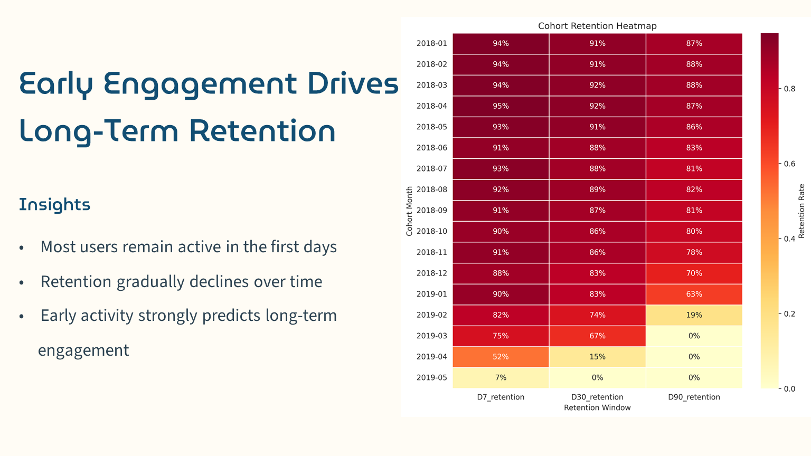
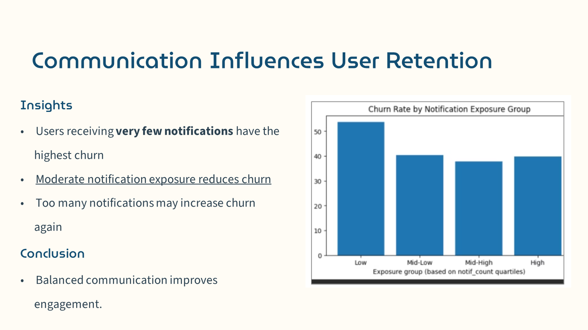

# Neo-Bank User Churn Analysis

## Overview
This project analyzes user behavior in a neo-bank to identify key drivers of churn, engagement patterns, and retention trends. The goal is to understand why users leave and how to improve long-term retention through data-driven strategies.

## Objectives
- Identify key churn drivers
- Analyze user engagement and activity patterns
- Build retention cohorts (D7, D30, D90)
- Segment users based on behavior and characteristics
- Provide actionable business recommendations

## Tools & Technologies
- SQL
- Python
- Power BI

## Dataset
The dataset includes:
- User data (demographics, plan, activity)
- Transactions (activity, volume, outcomes)
- Notifications (communication exposure)

## Key Analyses

### Churn Definition
Users are considered churned after 30 days of inactivity.

### User Segmentation
- Plan (Standard, Premium, Metal)
- Country and location
- Device usage
- Marketing opt-in

### Retention Analysis
- Cohort analysis (D7, D30, D90)
- Early engagement vs long-term retention

### Engagement Analysis
- Transaction activity
- Notification exposure
- Failed payments

## Key Insights
- User activity is the strongest predictor of churn
- Users with low activity show very high churn rates
- Early engagement strongly impacts long-term retention
- Standard plan contributes the most to churn
- Balanced notification strategy improves engagement
- Excessive notifications may increase churn

## Business Recommendations
- Increase early user engagement
- Monitor inactivity signals
- Optimize notification strategy
- Focus on high-risk segments

## Dashboard

### Key Insights

#### User Activity vs Churn

#### Retention Analysis

#### Notifications Impact

## Conclusion
Churn is primarily driven by low engagement and inactivity. Improving early user activity, optimizing communication strategies, and targeting high-risk users can significantly improve retention.

## Author
Amir Langroudi
Data Analyst | SQL | Python | Power BI
